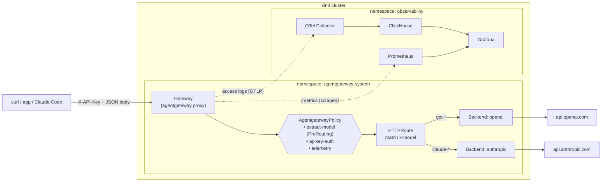

# One LLM gateway for your whole team, on Kubernetes

This repo builds a small but real **AI gateway**: a single endpoint that your apps
and developers point at instead of OpenAI, Anthropic, and friends directly. The
gateway authenticates callers, routes each request to the right model provider,
and records who spent how many tokens — so you can see usage per team and per user.

It uses [**agentgateway**](https://agentgateway.dev) (an open-source, AI-native
proxy) driven entirely through the **Kubernetes Gateway API**. If you have seen the
Gateway API before for normal HTTP traffic (`Gateway` + `HTTPRoute`), this is the
same model applied to LLM traffic, with a couple of small CRDs on top.

Everything here runs locally in a [kind](https://kind.sigs.k8s.io/) cluster. The
only thing you bring is an API key or two.

> This is the Gateway-API port of a real internal "front all our LLM usage through
> one proxy" config that runs in production. That original used agentgateway's
> standalone file-based config; here we express the same ideas as Kubernetes
> resources. See [How this maps to the standalone config](#how-this-maps-to-the-standalone-config).

---

## What you'll build



The demo is layered so you can stop at whatever depth fits your audience:

| Layer | What it shows |
|-------|---------------|
| **Routing** | One endpoint, many providers. `gpt-*` → OpenAI, `claude-*` → Anthropic, chosen from the `model` field in the request. |
| **Security (basic)** | A static API key is required (`X-API-Key`). |
| **Observability L1** | Prometheus + Grafana: requests and tokens broken down **by team**. |
| **Observability L2** | Access logs → OTel Collector → ClickHouse → Grafana: a row **per request, per user**. |
| **Security (advanced)** | Log in with a real Google identity; authorize by verified email. |

The walkthrough applies **three** `AgentgatewayPolicy` resources on the base path
(`extract-model`, `apikey-auth`, `telemetry`). The advanced step adds
`google-oauth-tls` (backend TLS for JWKS) and `llm-access-control` (JWT + relaxed
API key + authorization), and removes `apikey-auth`.

---

## Prerequisites

You need these on your machine (versions are what this was tested with; nearby
versions are fine):

| Tool | Tested | Install |
|------|--------|---------|
| Docker | 29.x | https://docs.docker.com/get-docker/ |
| kind | 0.31 | `go install sigs.k8s.io/kind@latest` or [releases](https://github.com/kubernetes-sigs/kind/releases) |
| kubectl | 1.35 | https://kubernetes.io/docs/tasks/tools/ |
| helm | 4.x | https://helm.sh/docs/intro/install/ |

And at least one LLM API key:

- **OpenAI** key (for `gpt-*`) — https://platform.openai.com/api-keys
- **Anthropic** key (for `claude-*`, optional) — https://console.anthropic.com/

```bash
cp .env.example .env
$EDITOR .env          # paste your keys
source .env
```

`.env` is gitignored. Keys are turned into Kubernetes Secrets at deploy time and
never written into any committed file.

---

## TL;DR — just run it

```bash
source .env
./scripts/up.sh          # creates the cluster and deploys everything (~3-5 min)
```

Then jump to [Send a request](#6-send-a-real-request) and
[the dashboards](#9-level-1--metrics-by-team). To remove everything:
`./scripts/down.sh`.

The rest of this README is the **guided walkthrough** — the version to follow live
on stage, where each step introduces one concept.

---

## Guided walkthrough

### 1. Create the cluster

```bash
kind create cluster --name agentgateway-demo --wait 120s
```

One Docker container, one Kubernetes node (kind's default). That's the whole "cluster".

### 2. Install the Gateway API and agentgateway

The Kubernetes Gateway API is a set of CRDs (`Gateway`, `HTTPRoute`, ...). They
define the *vocabulary* but ship no implementation, so we install both: the
upstream CRDs, then agentgateway as the controller that turns those resources into
a running proxy.

```bash
# 2a. Upstream Gateway API CRDs
kubectl apply --server-side --force-conflicts \
  -f https://github.com/kubernetes-sigs/gateway-api/releases/download/v1.5.0/standard-install.yaml

# 2b. agentgateway control plane (Helm)
helm upgrade -i agentgateway-crds oci://cr.agentgateway.dev/charts/agentgateway-crds \
  --create-namespace --namespace agentgateway-system --version v1.2.1 \
  --set controller.image.pullPolicy=Always

helm upgrade -i agentgateway oci://cr.agentgateway.dev/charts/agentgateway \
  --namespace agentgateway-system --version v1.2.1 \
  --set controller.image.pullPolicy=Always \
  --set controller.extraEnv.KGW_ENABLE_GATEWAY_API_EXPERIMENTAL_FEATURES=true \
  --wait
```

This registers a **GatewayClass** named `agentgateway`. A GatewayClass is "which
implementation should handle my Gateways" — like a StorageClass, but for proxies.

```bash
kubectl get gatewayclass
# NAME           CONTROLLER                      ACCEPTED
# agentgateway   agentgateway.dev/agentgateway   True
```

### 3. The Gateway (the front door)

[`k8s/agentgateway/00-gateway.yaml`](k8s/agentgateway/00-gateway.yaml) is a plain
Gateway API `Gateway`. The only agentgateway-specific line is
`gatewayClassName: agentgateway`.

```bash
kubectl apply -f k8s/agentgateway/00-gateway.yaml
kubectl get gateway -n agentgateway-system
```

Creating the Gateway makes the control plane deploy an actual proxy for you — a
Deployment and Service both named `agentgateway-proxy`.

### 4. Provider backends

A standard `HTTPRoute` sends traffic to a `Service`. For LLMs we instead use an
agentgateway CRD, **`AgentgatewayBackend`**, which knows how to speak each
provider's API. [`k8s/agentgateway/10-backends.yaml`](k8s/agentgateway/10-backends.yaml)
defines two:

```yaml
apiVersion: agentgateway.dev/v1alpha1
kind: AgentgatewayBackend
metadata: { name: openai, namespace: agentgateway-system }
spec:
  ai:
    provider:
      openai: {}                 # no model pinned: the caller's model passes through
  policies:
    auth:
      secretRef: { name: openai-secret }   # the API key lives in a Secret
```

The provider key is read from a Kubernetes Secret (key `Authorization`), created
from your environment variables — not from the manifest:

```bash
source .env
./scripts/create-secrets.sh
kubectl apply -f k8s/agentgateway/10-backends.yaml

kubectl get agentgatewaybackend -n agentgateway-system
# NAME        ACCEPTED
# anthropic   True
# openai      True
```

> If a backend shows `ACCEPTED: False` with `secret ... not found`, you skipped
> `create-secrets.sh`. It reconciles automatically once the Secret exists.

### 5. Model-name routing

Here is the central idea. Callers always hit the same path
(`/v1/chat/completions`) and just change the `model` field in the JSON body. We
want `gpt-*` to go to OpenAI and `claude-*` to go to Anthropic.

The Gateway API matches on HTTP attributes (path, headers), not on JSON bodies. So
[`k8s/agentgateway/20-routes.yaml`](k8s/agentgateway/20-routes.yaml) does it in two
moves:

1. The **`extract-model`** policy copies `model` out of the body into an `x-model`
   header, in the `PreRouting` phase (before route matching):

   ```yaml
   traffic:
     phase: PreRouting
     transformation:
       request:
         set:
           - name: x-model
             value: 'has(json(request.body).model) ? json(request.body).model : ""'
   ```

2. An **`HTTPRoute`** matches that header with a regex and forwards to the right
   backend:

   ```yaml
   - matches:
       - path: { type: PathPrefix, value: /v1/chat/completions }
         headers:
           - { type: RegularExpression, name: x-model, value: "^gpt-.*" }
     backendRefs:
       - { group: agentgateway.dev, kind: AgentgatewayBackend, name: openai }
   ```

```bash
kubectl apply -f k8s/agentgateway/20-routes.yaml
```

### 6. Send a real request

Expose the proxy locally:

```bash
kubectl port-forward -n agentgateway-system deploy/agentgateway-proxy 8080:80
```

In another terminal, ask for a GPT model:

```bash
curl -s http://localhost:8080/v1/chat/completions \
  -H 'Content-Type: application/json' \
  -d '{"model":"gpt-4o-mini","messages":[{"role":"user","content":"Reply with exactly: gateway works"}],"max_tokens":20}'
```

```json
{ "choices":[{"message":{"role":"assistant","content":"gateway works"}}], "usage":{"total_tokens":15}, ... }
```

Now ask for a Claude model — **same endpoint, same request shape**, just a
different `model`:

```bash
curl -s http://localhost:8080/v1/chat/completions \
  -H 'Content-Type: application/json' \
  -d '{"model":"claude-sonnet-4-5","messages":[{"role":"user","content":"hi"}],"max_tokens":20}'
```

If you set an Anthropic key you'll get a Claude reply. If not, you'll get
Anthropic's own auth error — which still proves the request was translated and
routed to Anthropic. An unknown model (`"model":"mistral-large"`) returns
`route not found`, because nothing routes it.

### 7. Lock it down: API-key auth

Right now anyone who can reach the proxy can use it. Let's require a key.
[`k8s/agentgateway/30-auth.yaml`](k8s/agentgateway/30-auth.yaml) adds an
`apikey-auth` policy with `apiKeyAuthentication` (read from the `X-API-Key`
header) plus a Secret holding one demo key with attached metadata:

```yaml
stringData:
  demo-engineering: |
    { "key": "demo-key-engineering",
      "metadata": { "user": "demo-user", "org": "engineering" } }
```

That `metadata` rides along with the request and we'll use it for logs and authz.

```bash
kubectl apply -f k8s/agentgateway/30-auth.yaml
```

```bash
# No key -> rejected
curl -s -o /dev/null -w '%{http_code}\n' -X POST http://localhost:8080/v1/chat/completions \
  -H 'Content-Type: application/json' \
  -d '{"model":"gpt-4o-mini","messages":[{"role":"user","content":"hi"}]}'
# 401

# With key -> allowed
curl -s -o /dev/null -w '%{http_code}\n' -X POST http://localhost:8080/v1/chat/completions \
  -H 'Content-Type: application/json' -H 'X-API-Key: demo-key-engineering' \
  -d '{"model":"gpt-4o-mini","messages":[{"role":"user","content":"hi"}],"max_tokens":5}'
# 200
```

From now on, include `-H 'X-API-Key: demo-key-engineering'` on every call. Also
include a team header, `-H 'x-org: engineering'`, which the next steps use to
attribute usage.

### 8. The observability stack

[`k8s/observability/`](k8s/observability/) deploys four small single-pod
workloads:

- **Prometheus** — scrapes the proxy's `/metrics` (port 15020).
- **OpenTelemetry Collector** — receives access logs over OTLP/gRPC.
- **ClickHouse** — stores those logs (one row per request).
- **Grafana** — dashboards over both, with Prometheus and ClickHouse datasources
  pre-wired.

```bash
kubectl apply -f k8s/observability/
kubectl -n observability rollout status deploy/grafana --timeout=180s
```

One **`telemetry`** policy in
[`k8s/agentgateway/40-telemetry.yaml`](k8s/agentgateway/40-telemetry.yaml)
enriches both Prometheus metrics and OTLP access logs with business context, using
CEL expressions under a single `frontend:` block:

```yaml
metadata: { name: telemetry }
spec:
  frontend:
    metrics:
      attributes:
        add:
          - { name: org, expression: 'request.headers["x-org"]' }
    accessLog:
      otlp:
        protocol: GRPC
        backendRef: { kind: Service, name: otel-collector, namespace: observability, port: 4317 }
      attributes:
        add:
          - { name: org,   expression: 'request.headers["x-org"]' }
          - { name: user_email, expression: 'has(jwt.email) ? jwt.email : (has(apiKey.user) ? apiKey.user : "anonymous")' }
```

The collector lives in another namespace, so a `ReferenceGrant` (also in that
file) authorizes the cross-namespace reference — a normal Gateway API safeguard.

```bash
kubectl apply -f k8s/agentgateway/40-telemetry.yaml
```

Generate some traffic across a few teams to fill the dashboards:

```bash
./scripts/generate-traffic.sh 30      # 30 requests; omit the number to loop
```

### 9. Level 1 — metrics by team

```bash
kubectl port-forward -n observability svc/grafana 3000:3000
# http://localhost:3000   (admin / admin)
```

Open the **Agentgateway — LLM usage (Prometheus)** dashboard. You'll see total
requests and total tokens broken down by `org`, and live request/token rates.
Under the hood these come from agentgateway's built-in metrics, e.g.:

```promql
sum by (org) (agentgateway_gen_ai_client_token_usage_sum)
sum by (org) (rate(agentgateway_requests_total[1m]))
```

The `org` label is the one the `telemetry` policy adds to metrics. Metric labels
must stay low-cardinality (a label value per user would explode storage), which is
exactly why per-user detail goes to logs instead — Level 2.

### 10. Level 2 — access logs by user (ClickHouse)

Open the **Agentgateway — Access logs (ClickHouse)** dashboard. Every request is a
row, queried straight from ClickHouse:

```sql
SELECT LogAttributes['org'] AS org,
       LogAttributes['user_email'] AS user_email,
       count() AS requests
FROM otel.otel_logs
GROUP BY org, user_email
ORDER BY requests DESC
```

This is the per-user, per-team cost-attribution view. The custom attributes
(`org`, `user_email`) are the ones the `telemetry` policy attaches to access logs; the model
and timing come built in. The OTel Collector's ClickHouse exporter creates the
`otel.otel_logs` table for you on first write.

### 11. (Advanced) Log in with Google, authorize by email

A shared static key is fine for a service account, but for *people* you usually
want real identity. [`k8s/agentgateway/advanced/jwt-google.yaml`](k8s/agentgateway/advanced/jwt-google.yaml)
adds a static backend for Google's JWKS, a backend-TLS policy for it, and one
merged Gateway policy — **`llm-access-control`** — that bundles JWT validation,
relaxed API-key auth, and the CEL authorization rule:

- **`jwtAuthentication`** (mode `Optional`) validates Google ID tokens. Google's
  signing keys (JWKS) are fetched through the `google-oauth` backend (remote JWKS
  must be reached via a `backendRef`, not a bare URL).
- **`apiKeyAuthentication`** (mode `Optional`) still accepts `X-API-Key`, but no
  longer rejects requests that arrive without one.
- **`authorization`** requires, in CEL, *either* a verified `@solo.io` email *or*
  a valid API key:

  ```yaml
  metadata: { name: llm-access-control }
  spec:
    traffic:
      jwtAuthentication: { mode: Optional, providers: [...] }
      apiKeyAuthentication: { mode: Optional, location: { header: { name: X-API-Key } }, ... }
      authorization:
        action: Allow
        policy:
          matchExpressions:
            - '(has(jwt.email) && jwt.email.endsWith("@solo.io") && jwt.email_verified) || has(apiKey.user)'
  ```

Remove the step-7 `apikey-auth` policy first — `llm-access-control` replaces it.
(The `jwt-google` / `llm-authorization` names are only deleted if you applied an
older version of this repo.)

```bash
kubectl delete agentgatewaypolicy apikey-auth jwt-google llm-authorization -n agentgateway-system --ignore-not-found
kubectl apply -f k8s/agentgateway/advanced/jwt-google.yaml
```

Test the three outcomes:

```bash
# Valid API key -> 200 (apiKey branch)
curl -s -o /dev/null -w 'apikey  -> %{http_code}\n' -X POST http://localhost:8080/v1/chat/completions \
  -H 'x-api-key: demo-key-engineering' -H 'x-org: engineering' \
  -H 'Content-Type: application/json' -d '{"model":"gpt-4o-mini","messages":[{"role":"user","content":"hi"}],"max_tokens":5}'

# Neither credential -> 403 (authorization denies)
curl -s -o /dev/null -w 'nothing -> %{http_code}\n' -X POST http://localhost:8080/v1/chat/completions \
  -H 'Content-Type: application/json' -d '{"model":"gpt-4o-mini","messages":[{"role":"user","content":"hi"}]}'

# Real Google identity (run on a machine logged into gcloud with your @solo.io account):
TOKEN=$(gcloud auth print-identity-token)
curl -s -o /dev/null -w 'google  -> %{http_code}\n' -X POST http://localhost:8080/v1/chat/completions \
  -H "Authorization: Bearer $TOKEN" -H 'x-org: engineering' \
  -H 'Content-Type: application/json' -d '{"model":"gpt-4o-mini","messages":[{"role":"user","content":"hi"}],"max_tokens":5}'
```

The `audiences` field in the policy is set to the gcloud CLI's client id, which is
the `aud` of tokens from `gcloud auth print-identity-token`. Use your own OAuth
client id if you mint tokens another way. With a real token, the access-log
`user_email` now shows the actual signed-in address instead of `demo-user`.

### Optional — add a third provider (Fireworks)

[`k8s/agentgateway/extras/fireworks.yaml`](k8s/agentgateway/extras/fireworks.yaml)
shows the OpenAI-compatible pattern: the same `openai` provider type with the
upstream host overridden, plus a route for `accounts/fireworks/*` models.

```bash
export FIREWORKS_API_KEY=...; ./scripts/create-secrets.sh
kubectl apply -f k8s/agentgateway/extras/fireworks.yaml
```

You can test models from it (e.g. Kimi K2.6 hosted via Fireworks as `accounts/fireworks/models/kimi-k2p6`). If your port-forward is stale (common after applying extra yamls), re-run it first:

```bash
kubectl port-forward -n agentgateway-system deploy/agentgateway-proxy 8080:80
```

```bash
curl -s http://localhost:8080/v1/chat/completions \
  -H 'Content-Type: application/json' -H 'X-API-Key: demo-key-engineering' \
  -d '{"model":"accounts/fireworks/models/kimi-k2p6","messages":[{"role":"user","content":"hi"}],"max_tokens":20}'
```

(Real responses require a valid `FIREWORKS_API_KEY` with access to the model; otherwise you will see the provider's error.)
```

Also fix the yaml comments to be accurate.
---


## Cleanup

```bash
./scripts/down.sh           # deletes the kind cluster and everything in it
```

---

## Troubleshooting

| Symptom | Fix |
|---|---|
| `AgentgatewayBackend` `ACCEPTED: False`, "secret not found" | Run `source .env && ./scripts/create-secrets.sh`. |
| Requests return `route not found` (404) | The `model` doesn't match any route regex (`^gpt-`, `^claude-`). Check the `model` in your body. |
| `401` on every call | API-key auth is on; add `-H 'X-API-Key: demo-key-engineering'`. |
| Leftover policies after a repo update | Re-run `./scripts/up.sh`, or delete orphans: `metrics-labels`, `access-logs-otlp`, `jwt-google`, `llm-authorization`. |
| Provider returns its own auth error | The provider key is missing/invalid. Recreate the Secret with a real key. |
| Grafana ClickHouse panels empty | Send traffic, then check the collector: `kubectl logs -n observability deploy/otel-collector`. Plugin install needs internet on first Grafana boot. |
| Prometheus target down | Confirm the proxy pod is running; metrics are on pod port `15020`. |
| Port-forward dropped | It dies if the pod restarts (e.g. after a policy change). Re-run the `kubectl port-forward` command. |

Handy inspection commands:

```bash
kubectl get agentgatewaybackend,agentgatewaypolicy,httproute,gateway -n agentgateway-system
kubectl get agentgatewaypolicy -n agentgateway-system -o yaml          # see status conditions
kubectl logs -n agentgateway-system deploy/agentgateway-proxy          # proxy logs
```

---

## Repo layout

```
.env.example                       # where your API keys go (copy to .env)
scripts/
  up.sh                            # one-shot: create cluster + deploy everything
  down.sh                          # delete the cluster
  create-secrets.sh                # provider Secrets from env vars
  generate-traffic.sh              # demo traffic generator
k8s/agentgateway/
  00-gateway.yaml                  # the Gateway (front door)
  10-backends.yaml                 # AgentgatewayBackend: openai, anthropic
  20-routes.yaml                   # model->header transform + HTTPRoute
  30-auth.yaml                     # apikey-auth (Strict API-key authentication)
  40-telemetry.yaml                # telemetry (metrics labels + OTLP access logs + ReferenceGrant)
  advanced/jwt-google.yaml         # google-oauth backend + llm-access-control (JWT + authz)
  extras/fireworks.yaml            # optional OpenAI-compatible provider
k8s/observability/                 # ClickHouse, OTel Collector, Prometheus, Grafana
```

